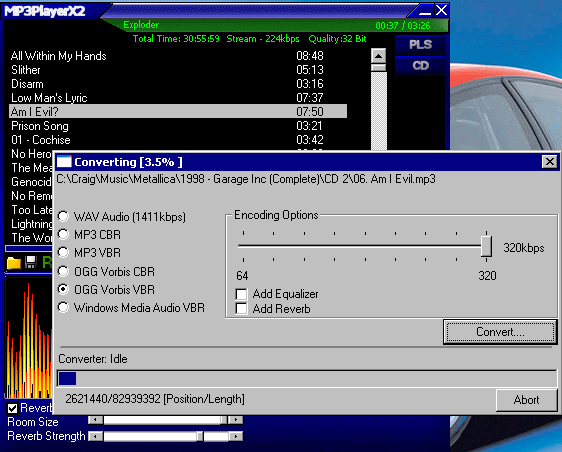



## MP3PlayerX2

### Description

Plays and Converts/Rips MP3/OGG/WAV/WMA and CD Audio Tracks. Uses the BASS Audio Library from www.un4seen.com. Supports M3U/PLS playlists. Includes shuffler, ID3v1 tag editor and support for the LAME encoder as well as the OGG Encoder.
 
### More Info
 

             |
---                |---
**Submitted On**   |2004-02-05 22:52:42
**By**             |[Craig10000](https://github.com/Planet-Source-Code/PSCIndex/blob/master/ByAuthor/craig10000.md)
**Level**          |Advanced
**User Rating**    |5.0 (15 globes from 3 users)
**Compatibility**  |VB 5\.0, VB 6\.0
**Category**       |[Sound/MP3](https://github.com/Planet-Source-Code/PSCIndex/blob/master/ByCategory/sound-mp3__1-45.md)
**World**          |[Visual Basic](https://github.com/Planet-Source-Code/PSCIndex/blob/master/ByWorld/visual-basic.md)
**Archive File**   |[MP3PlayerX170526272004\.zip](https://github.com/Planet-Source-Code/craig10000-mp3playerx2__1-51559/archive/master.zip)

